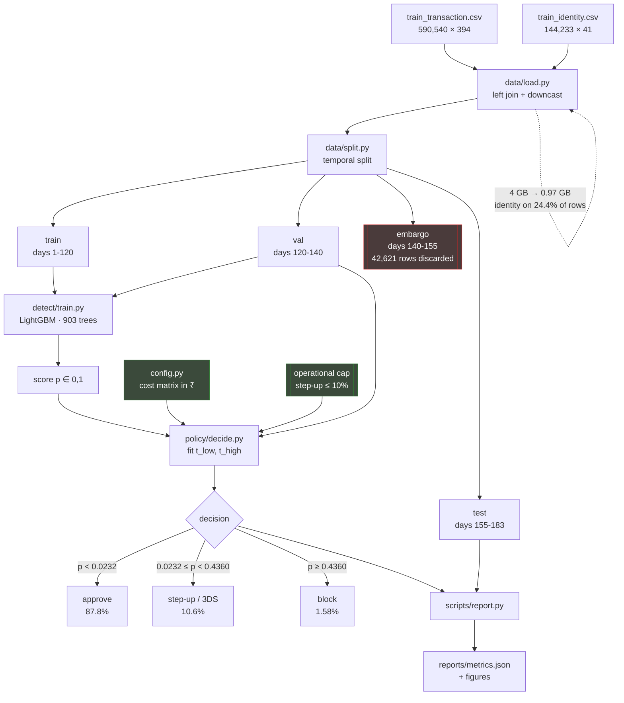

# Architecture

## Flow

The two green boxes are the contribution. Everything else is standard practice.

---

## Design decisions

### The split is a separate module

`data/split.py` contains no feature logic — only the temporal boundaries and the embargo. A reviewer can confirm in thirty seconds that nothing from the future reaches training, and `tests/test_split.py` fails the build if that ever stops being true.

Leakage rarely arrives as someone deliberately writing `shuffle=True`. It arrives three weeks later when a resampling step quietly puts the same rows on both sides. The test catches it the moment it happens.

### The embargo discards 7% of the data on purpose

Chargebacks surface 30–90 days after a transaction. At serving time you do not have labels for recent weeks, so training right up to the test boundary simulates an oracle you will never have. Dropping days 140–155 costs accuracy and buys a test set that means something.

### Probabilities are left undistorted

No `scale_pos_weight`, no resampling. Both improve ranking metrics and corrupt the probability scale — and the decision layer compares `p` to an absolute threshold in rupees. Imbalance is handled at the threshold, where it belongs.

### All economic assumptions live in one file

`config.py` holds the cost matrix, the split boundaries, and the currency assumption. Nothing downstream hard-codes a number. "What does a false positive cost?" has exactly one answer, in one place, and changing it re-prices the whole pipeline.

### The decision is three-way, not binary

A binary policy forces every uncertain order into approve-or-decline, and a wrong decline costs a whole sale. A step-up costs a fraction of that: most genuine customers pass, most fraudsters fail. The middle band is where uncertainty belongs.

This is worth **₹1,591,618 per 10,000 orders** over the same model's best binary policy — more than any feature work attempted.

### The optimiser is constrained

Left free, the optimiser challenges 15.9% of traffic. No merchant accepts that. `optimise(..., max_stepup_rate=0.10)` costs 2.7% of the theoretical gain and produces a policy that could actually ship. An unconstrained optimum that no one would deploy is not a result.

### Every published number is generated

`scripts/report.py` writes `reports/metrics.json` and the figures. The README cites that file. No metric is hand-typed, so none can drift from the code that produced it.

---

## Rejected designs

**Connected components as a model feature.** The obvious way to detect rings is to build a graph over shared attributes and use component size as an input. It leaks catastrophically: a day-10 transaction would carry a component size computed from day-150 activity. Every metric would improve and the model would be worthless in production, because at authorisation time that component does not exist.

Ring features were instead built as strictly backward-looking co-occurrence counts — *"how many distinct cards has this device been seen with in the trailing 7 days?"* They were then measured and rejected on their merits (see README). Component analysis remains appropriate for investigation and display, never as an input.

**Amount-dependent thresholds.** `config.breakeven_threshold` is a function of order value, on the reasoning that a ₹500 and a ₹50,000 order should not face the same bar. Measured, it ranges only 0.200–0.214 — the fixed dispute fee and fixed churn cost push in opposite directions and nearly cancel. A single global threshold fitted to data beat it by ₹168,511 per 10k orders. The function is retained for documentation; the shipped policy uses a global cut.

**Isotonic calibration for decisions.** It fixed the bias (−0.0103 → +0.0003) and collapsed 77,630 distinct scores to 127, destroying ranking and raising cost. Retained for communicating risk to a merchant, not for making the decision.
