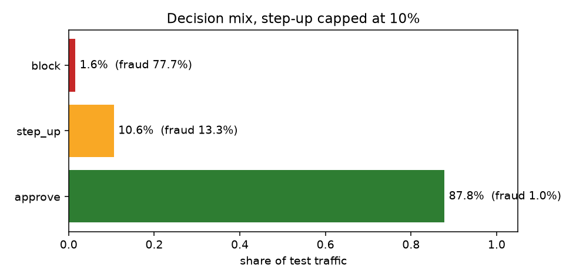
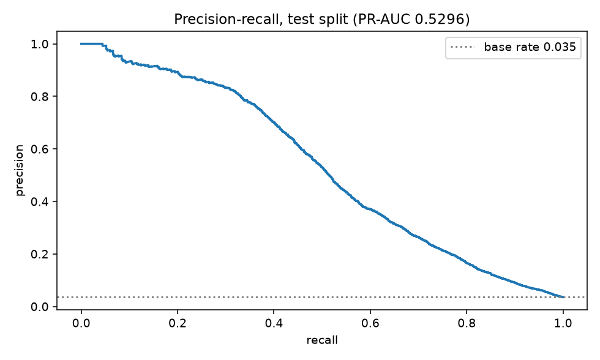
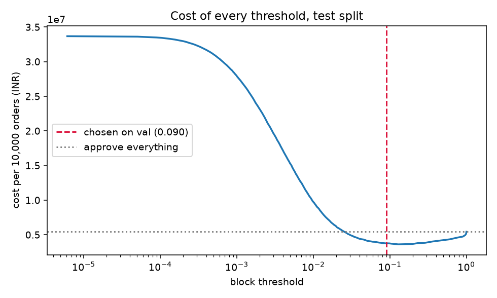

# Kavach — cost-aware chargeback defense

**Razorpay AI Buildathon · Track 02, AI Risk Manager**

A card-not-present fraud detector whose output is a *decision priced in rupees*, not a probability. One class of loss: chargebacks.

> **₹3,278,504 saved per 10,000 orders** on a held-out test set, against a merchant who approves everything — and **1.9× what the same model earns** under a conventional block/allow policy.

All figures below are regenerated by `python scripts/report.py` into [`reports/metrics.json`](reports/metrics.json). Nothing in this README is typed by hand.

---

## The thesis

The detector is commodity. Anyone can train LightGBM on IEEE-CIS and land within a point or two of anyone else — and there are three failed experiments below proving we tried to beat it and could not.

The money is not in the model. It is in the layer that turns a score into an action:

1. **A cost matrix.** What a false positive actually costs, in rupees, versus a false negative.
2. **A third option.** Approve / **step-up** / block, because friction is far cheaper than a wrong decline.
3. **An operational constraint.** No merchant will challenge a quarter of their traffic, whatever the optimiser says.

Those three things are worth **₹1.59M per 10,000 orders** on top of the same model's best binary policy. No feature engineering we attempted came close.

---

## Results

### The decision, priced

| Policy | Cost / 10k orders | Saved vs approve-all |
|---|---:|---:|
| Approve everything | ₹5,436,325 | — |
| Block at 0.50 *(the default nobody questions)* | ₹4,197,756 | ₹1,238,569 |
| Block at cost-optimal threshold `t=0.0904` | ₹3,749,439 | ₹1,686,886 |
| Three-way, uncapped `0.0146 / 0.4360` | ₹2,066,776 | ₹3,369,549 |
| **Three-way, step-up ≤ 10% `0.0232 / 0.4360`** | **₹2,157,821** | **₹3,278,504** |

The last row is what we ship. The uncapped optimum challenges 15.9% of traffic, which is not operationally acceptable; capping at 10% costs 2.7% of the gain and makes the policy real.

**Why 0.50 is the wrong default.** It asserts that a false positive and a false negative cost the same. Under our cost model they differ by roughly 6×, and the break-even is `p* = C_fp / (C_fp + C_fn) ≈ 0.20` — before any empirical tuning.

### Decision mix

| Decision | Share of traffic | Fraud rate in band |
|---|---:|---:|
| approve | 87.8% | 1.02% |
| step-up | 10.6% | 13.33% |
| block | 1.58% | 77.68% |

Blocking 1.6% of orders at 77.7% precision, against 4.3% at 44.8% under the binary policy. Two-thirds fewer good customers turned away, for more money saved.



### Detector, held-out test split

| Metric | Value |
|---|---:|
| PR-AUC | 0.5296 |
| Recall @ precision 50% | 0.5148 |
| Recall @ precision 60% | 0.4564 |
| Recall @ precision 70% | 0.4009 |
| Precision @ top 1000 | 0.832 |
| ROC-AUC | 0.9007 |

ROC-AUC is reported last, deliberately. At a 3.5% base rate it stays flattering while an analyst drowns in false positives. Recall at a precision a review team can actually staff is the number that matters.




---

## How the metrics are kept honest

**Temporal split with a label-latency embargo.** Train days 1–120, validate 120–140, **discard 140–155**, test 155–183. Chargebacks surface 30–90 days after a transaction, so in production you can never train on last month. We discard 42,621 rows to simulate that rather than quietly keeping them.

| Split | Rows | Days | Fraud rate |
|---|---:|---|---:|
| train | 410,601 | 1–120 | 3.51% |
| val | 58,776 | 120–140 | 3.52% |
| *embargo* | *42,621* | *140–155* | *discarded* |
| test | 78,542 | 155–183 | 3.53% |

**Every threshold is fitted on validation.** `tests/test_split.py` fails the build if any row appears in two splits, or if the embargo gap closes.

**We quantify our own optimism.** Tuning the threshold on the test set would report ₹3,612,262 instead of ₹3,749,439 — a **3.8% penalty** we pay for selecting honestly. Most reported numbers include that 3.8% silently.

**The result is not an artefact of assumed constants.** The two 3DS rates are assumptions, so we swept them: block-rate 0.50–0.95 × abandon-rate 0.03–0.25. The three-way policy beat binary in **16 of 16 cells**, including the corner where only half of fraudsters fail the challenge *and* a quarter of good customers abandon.

---

## What did not work

Three ideas built properly, measured, and rejected. They remain in the repo with their tests, because a negative result you can reproduce is worth more than a positive one you cannot.

| Experiment | Result | Why |
|---|---|---|
| **50 velocity features** — counts/sums per card, email, device over 1h/24h/7d | PR-AUC 0.5296 → 0.5355, **₹2,536 / 10k**, 2× training time | The dataset's `C` columns are *already* velocity aggregates engineered by Vesta. We rebuilt existing signal. |
| **12 ring features** — causal entity co-occurrence | PR-AUC → 0.5327 but **₹23,885 worse**; recall@prec70 *fell* | See the control, below. |
| **Isotonic calibration** | Bias −0.0103 → +0.0003, but PR-AUC → 0.5133 and cost rose | Isotonic collapsed 77,630 distinct scores to **127**. Ties destroy ranking. Retained for *communicating* risk, not for deciding. |

**The ring experiment carried a planted control.** `P_emaildomain × card1` was included expecting it to be useless — email domains are hubs, so "how many cards used gmail.com this week" is not a coordination signal. It came back as the **2nd and 3rd most important ring feature**. That tells us the features were measuring *traffic volume, not rings*, and explains the recall@prec70 regression. Without the control we would have shipped them believing otherwise.

---

## Architecture

```
raw IEEE-CIS ──▶ load.py ──────▶ left-join identity (24.4% coverage;
                    │             missingness kept as a feature)
                    ▼
              split.py ────────▶ temporal split + 15-day embargo
                    │             (isolated, test-guarded)
                    ▼
            detect/train.py ───▶ LightGBM, 903 trees, no scale_pos_weight
                    │             (probabilities must mean what they say)
                    ▼
            policy/costs.py ───▶ C_fn = amount + ₹1,800
                    │             C_fp = 0.25·amount + ₹500
                    ▼
           policy/decide.py ───▶ approve / step-up / block
                    │             thresholds fitted on val, step-up ≤ 10%
                    ▼
             eval/, reports/ ──▶ metrics.json + figures
```

**Defense-only by construction:** a detector, a cost model, and a decision policy. Nothing here generates, tests, or evades anything.

---

## Limitations

**Selection bias is unfixable, and we do not pretend otherwise.** A blocked order never generates a chargeback, so it never produces a label. Precision and recall here are measured on *approved* traffic — the population a deployed model progressively stops seeing. Every fraud team has this problem; the honest response is to name it, monitor block-band outcomes through manual review, and treat reported precision as an upper bound.

**The currency is assumed.** IEEE-CIS does not state its unit. We assume USD at ₹88, the community consensus. Every rupee figure scales linearly with that assumption; the *ordering* of the policies does not.

**3DS step-up is not a free lever in India.** RBI mandates AFA on most domestic card payments, so a challenge is already present there. This policy's step-up band applies to international cards, card-on-file and tokenised flows, recurring mandates, and AFA-exempt low-value traffic — and models any cheap intermediate friction generally (delivery confirmation, review queue, partial prepay on COD).

**One dataset, US-shaped.** IEEE-CIS is US e-commerce. Indian traffic differs in mix, ticket size, and instrument. The cost framework transfers; the trained weights would need refitting.

---

## Reproduce

```bash
py -3.13 -m venv .venv
```

```bash
pip install -e ".[dev]"
```

Place `train_transaction.csv` and `train_identity.csv` from [IEEE-CIS Fraud Detection](https://www.kaggle.com/c/ieee-fraud-detection/data) into `data/raw/`, then:

```bash
pytest -q
```

```bash
python scripts/report.py
```

The raw data is not committed: 1.3 GB and competition-licensed.

---

## Layout

```
src/kavach/
  config.py             cost matrix + split boundaries — one file, all assumptions
  data/split.py         temporal split, auditable in 30 seconds
  data/load.py          merge + downcast (4 GB → 0.97 GB)
  features/base.py      baseline features
  features/velocity.py  rejected experiment, kept with tests
  sentinel/rings.py     rejected experiment, kept with tests
  detect/train.py       LightGBM detector
  detect/calibrate.py   isotonic + ECE
  policy/costs.py       rupees
  policy/decide.py      approve / step-up / block, with operational caps
  eval/                 metrics, cost curve
scripts/report.py       regenerates every published number
tests/                  leakage and window guards
```
